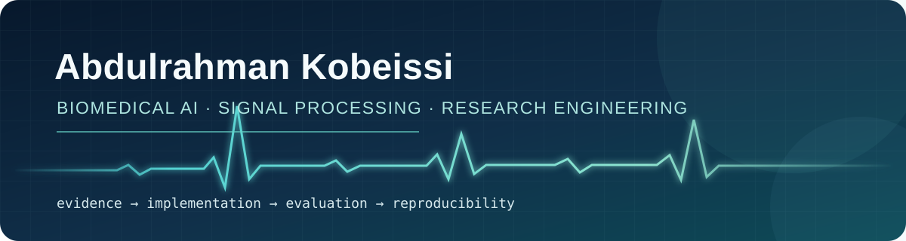

<div align="center">
  
</div>

<p align="center">
  <a href="https://orcid.org/0009-0007-3870-4619">ORCID</a>
  ·
  <a href="https://github.com/Abkob?tab=repositories">Repositories</a>
  ·
  <a href="#selected-work">Selected work</a>
  ·
  <a href="#research-practice">Research practice</a>
</p>

I am a Computer Science and Engineering student at the American University of Beirut, pursuing a Biomedical Engineering minor and a Data Science concentration. I build research software at the intersection of physiological signals, machine learning, and human-centered systems.

My current work centers on EEG/ECoG and ECG analysis in epilepsy, patient-aware model evaluation, signal-quality-aware feature extraction, and multimodal sensing for assistive technology. I enjoy the full research loop: reading primary literature, translating methods into code, testing assumptions, documenting limitations, and making the result reproducible.

## Research focus

```text
physiological signals -> quality control -> interpretable features
                      -> patient-aware models -> reproducible evidence
```

- Biomedical signal processing: EEG, ECoG, ECG, HRV, time-frequency analysis
- Machine learning: patient-aware evaluation, domain shift, deep learning, classical baselines
- Research engineering: evidence maps, experiment pipelines, testing, documentation, data boundaries
- Assistive technology: flexible multimodal sensors and prosthetic-interface monitoring
- Computer vision: detection, segmentation, geolocation, and data-annotation systems

## Selected work

| Project | What it demonstrates | Stack |
|---|---|---|
| [Research Portfolio](https://github.com/Abkob/Research_Portfolio) | Evidence maps and scoped case studies spanning ear-EEG, prosthetic sensing, computer vision for rubble environments, and sparse-camera room reconstruction | Literature synthesis, experimental design, reproducibility |
| [ECG Feature Detector](https://github.com/Abkob/ECG_FE_Detector_Interface) | Four-branch research implementation for R-peaks/RR/HRV, beat morphology, conduction/repolarization, and ECG signal quality, with tests and evidence-led documentation | Python, SciPy, notebooks, pytest |
| [BCI and Epilepsy Research](https://github.com/Abkob/Research_BCI) | Paper-guided EEG/ECoG feature-extraction notebooks, patient-aware questions, and explicit reproducibility boundaries | Python, NumPy, PyWavelets, scikit-learn |
| [WSP Offline System](https://github.com/Abkob/WSP_automationexcel) | Privacy-first local data ingestion, auditable semantic matching, record history, health checks, and Windows packaging | Python, SQLite, pandas, FAISS |
| [Amina OS](https://github.com/Abkob/Amina) | Local-first research/project system with structured truth, graph relationships, retrieval, and confirmable AI-assisted actions | React, TypeScript, PostgreSQL, pgvector |

Selected private and team work includes a smart multimodal prosthetic liner and Sinmar / Al-Mizan, a bilingual data-system modernization project. Public case studies explain the methods and engineering decisions without publishing operational records, team-confidential material, or copyrighted paper archives.

## Research practice

I treat a research claim as a chain of evidence, not a polished screenshot:

1. define the question, cohort, labels, and failure cases;
2. map claims to primary sources;
3. implement transparent baselines before complex models;
4. split biomedical data by patient and site to prevent leakage;
5. report uncertainty, negative results, and signal-quality limitations; and
6. keep raw human-subject data, credentials, and copyrighted paper files out of public repositories.

The [Machine Learning Research Syllabus](https://github.com/Abkob/Machine_Learning_Syllabus) is my public roadmap and evidence ledger. It separates **planned**, **studied**, **implemented**, **evaluated**, and **reproduced** work so progress is not overstated.

## Code and methods


- **Languages:** Python, MATLAB, Java, C/C++, SQL, R, JavaScript/TypeScript
- **ML and signals:** PyTorch, TensorFlow, scikit-learn, XGBoost, MNE-Python, EEGLAB, Brainstorm, SciPy
- **Engineering:** Git, Docker, ROS 2, Jupyter, Linux, Arduino, test automation, reproducible documentation

## Deliberate practice

- [LeetCode solutions](https://github.com/Abkob/LeetCode) - a transparent, test-backed log of problems I actually solve
- [DeepML solutions](https://github.com/Abkob/DeepML) - implementations for ML mathematics and modeling exercises I actually complete

These repositories start from a documented baseline and grow through verified solutions with reasoning, complexity analysis, and tests.

## Open to

- Biomedical AI and physiological-signal research collaborations
- Reproducibility, benchmarking, and research-software work
- Assistive sensing, rehabilitation engineering, and human-machine systems

For research identity and future publications, see my [ORCID record](https://orcid.org/0009-0007-3870-4619). For code, experiments, and documented limitations, explore the repositories above.
